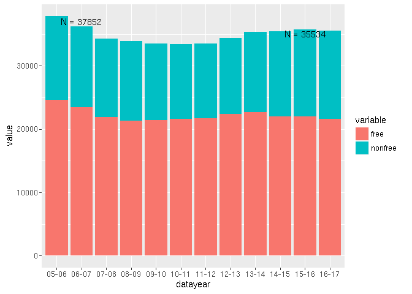

## Slowly declining enrollment
The MPS total enrollment has ebbed and flowed and it currently is {r enrll_diff enrll_direction} from 2005. 


```r
ggplot(mps_tmp, aes(x=datayear, y=value, fill=variable)) +
  geom_bar(stat="identity") +
  annotate("text", x="06-07", y=37000, label=paste0("N = ", total_2005)) +
  annotate("text", x="15-16", y=35000, label=paste0("N = ", total_n)) 
```

<!-- -->

## Loss of market share

## [MPS teachers](MPS_teachers.md)
