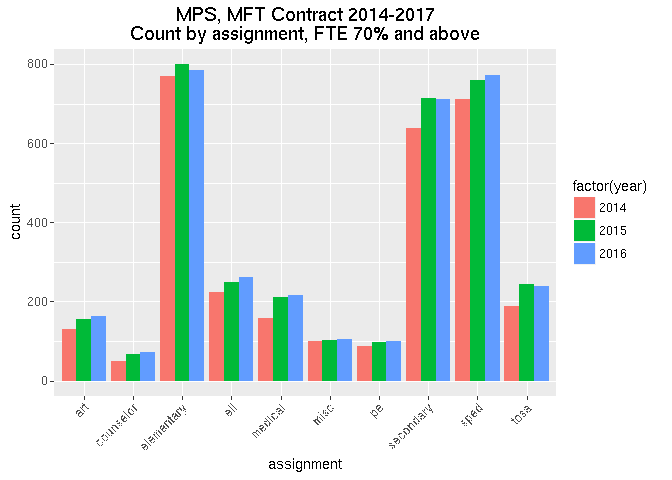
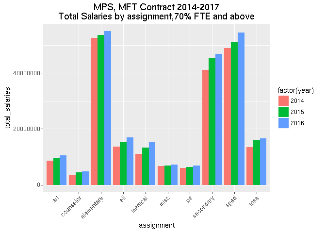

## Minneapolis

 


```r
ggplot(teach_byarea, aes(x=assignment, y=count, fill = factor(year))) +
  geom_bar(stat="identity", position="dodge") +
  theme(axis.text.x= element_text(angle=45, hjust=1)) +
  labs(title = "MPS, MFT Contract 2014-2017\nCount by assignment, FTE 70% and above")
```

<!-- -->


```r
ggplot(teach_byarea, aes(x=assignment, y=total_salaries, fill = factor(year))) +
  geom_bar(stat="identity", position="dodge") +
  theme(axis.text.x= element_text(angle=45, hjust=1)) +
  labs(title = "MPS, MFT Contract 2014-2017\nTotal Salaries by assignment,70% FTE and above")
```

<!-- -->
