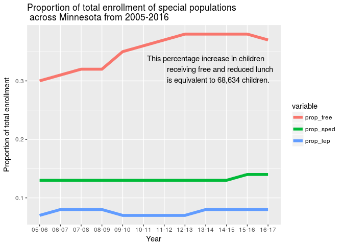

_All datasets were downloaded from the [Minnesota Department of Education Data Center](http://w20.education.state.mn.us/MDEAnalytics/Data.jsp) in October 2017._ 
_The raw data used is discussed at [datasets](datasets.md)_


## [](#header-2) Homepage, data from 2005-2016
* Compiled and analyzed by Carla Bates.
* Main datasets sets and subsequent analysis will be updated annually.
* Site created January 2018; this page updated 2018-02-02

**Extraordinary passions light up numerous debates on education today.**  Data is disparaged by the left who seem aesthically opposed to numbers for some reason or used as a cudgel by the right to beat up on the latest community school in the name of progress.  These flailings mask real questions about power and indicate cracks in how we think about our state, about who lives in our state, about who should benefit from the bounty of our state, and about our shared future. These are not questions to be answered with data but we have little chance of forging a just and sustainable future if we continue to ignore what the data can show us about how we are currently operating.

This website offers data and analysis in the hopes of building common ground on which to stand when debating how to educate our children.

### [](#header-3) MNk12 enrollment data 
The dataset 's_byDistrict' described at [datasets](datasets.Rmd) includes information on student demographics in each district in the state in the following categories:

* 'free' is free and reduced lunch
* 'sped' is special education
* 'lep' is limited English proficency

S_byDistrict contains 6225 'districts' of different 'types' - charters, co-ops, independent school systems.  We'll review districts by 'type' later.


```
##   datayear    region  county                         district free sped
## 1    05-06 Arrowhead  Aitkin    AITKIN PUBLIC SCHOOL DISTRICT  486  162
## 2    05-06 Arrowhead  Aitkin HILL CITY PUBLIC SCHOOL DISTRICT  181   55
## 3    05-06 Arrowhead  Aitkin  MCGREGOR PUBLIC SCHOOL DISTRICT  275   74
## 4    05-06 Arrowhead Carlton    BARNUM PUBLIC SCHOOL DISTRICT  245   97
## 5    05-06 Arrowhead Carlton   CARLTON PUBLIC SCHOOL DISTRICT  174   72
## 6    05-06 Arrowhead Carlton   CLOQUET PUBLIC SCHOOL DISTRICT  785  269
##   lep enrll
## 1   0  1311
## 2   0   328
## 3   0   452
## 4   0   679
## 5   0   579
## 6   2  2271
```

For each year, the enrollment data for each group in each district was totaled and then divided by total enrollment in order to determine statewide proportions.


```r
fn_sumEnr <- function(x) {
  x %>% summarise(enrll=sum(enrll, na.rm=TRUE),
                  free=sum(free, na.rm=TRUE), 
                  sped=sum(sped, na.rm=TRUE),
                  lep=sum(lep, na.rm=TRUE))
}
fn_propEnr <- function(x) {
  x %>% mutate_at(.vars = vars(3:5), 
                  .funs = funs(round((./enrll), 2)))
}
```

### [](#header-3) Total Enrollment:  students first.
From 2005 to 2016, the k12 student population in Minnesota increased by 28,504, a 3% increase. 


During this same period the numbers of students receiving free and reduced lunch increased by 68,634 students:  not only did more children in poverty join the k12 system but more children already within the system fell into poverty.  

Note the increase in poverty around the 2008-09 Great Recession and how we have not returned to pre 2008 levels.  

<!-- -->

The proportion of students receiving special education or of limited English proficency remained almost flat, increasing by 6% and 3% respectively.

* * *
****** [](#header-6)Explore further ...

* [Regional enrollment](question_2.md)
* [Statwide k12 financial picture]
* [Statwide k12 human resources]


