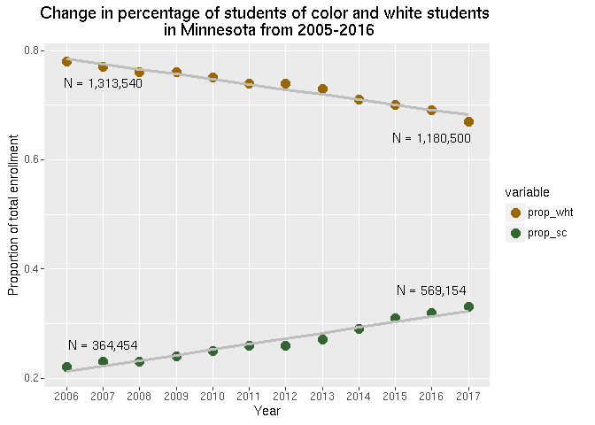

_All datasets were downloaded from the [Minnesota Department of Education Data Center](http://w20.education.state.mn.us/MDEAnalytics/Data.jsp) in October 2017._ 
_The raw data used is discussed at [datasets](datasets.md)_

##  Homepage, data from 2005-2016
* Compiled and analyzed by Carla Bates.
* Main datasets sets and subsequent analysis will be updated annually.
* Site created January 2018; this page updated 2018-03-01

**Extraordinary passions light up numerous debates on education today.**  Data is disparaged by the left who seem aesthically opposed to numbers or used as a cudgel by the right to beat up on yet another community school in the name of progress.  These flailings mask real questions about power and indicate cracks in how we think about our state, who lives here,  how our resources should be distributed, and what the future will hold. These are not questions to be answered with data but in order to develop just and sustainable answers we need to consider rather than ignore or exploit what the data can show us about how we are currently operating.

This website offers analysis in the hopes of building common ground on which to stand when debating how to educate our children.

###  We begin with race.

Racial demographics in Minnesota - as in the rest of the United States - are changing.
 
Consider the following changes in k12 enrollment statewide since 2005.

<!-- -->

Birthrates and immigration levels have been historically predictive of k12 enrollment. Birthrates in Minnesota indicate that the trends above will continue into the future, although they may not be as robust as they have been given the changing political environment around immigration.  Like the state as a whole, future k12 populations will be increasingly diverse. For more information on birth rates in Minnesota please consider [the work of the Mn State Demographer](https://mn.gov/admin/assets/mn-births-yet-to-rebound-to-prerecession-level-popnotes-nov2014_tcm36-219637.pdf)

If education is going to be the key to individual success, then we will need to address the racial disparities that now plague our system.  Public education in the United States has been successful on a broad basis with that mid-20th century sociological phenomena - the white middle class. The polyglot of immigrant communities - Irish, Italians, Poles, Finns, Germans - forged themselves into a white middle class using the public schools as a tool for the ammalgamation.  Public schools are celebrated as an essential part of the American 'melting pot' that resolved questions of nationalism, Protestant vs Catholic, and class antagonisms that had brought war to Europe for centuries.  

People hoped that public education could engineer another success story - Brown vs. the Board, the War on Poverty, No Child Left Behind, Race to the Top. But, again broadly speaking, public schools have only served to reinforce the status quo achieved post-WW2 and have failed 'to lift' students of color in great numbers into the white middle class via white 'collar' educational pathways. 

Now, changing demographics no longer provide white America with the 'luxury' of ignoring the effects of racism, nor ignoring the failure of our public schools to provide an education that is broadly successful for all children.    

* * *
****** Explore further ...

* [Regional enrollment](question_2.md)
* [Statwide k12 financial picture]
* [Statwide k12 human resources]

