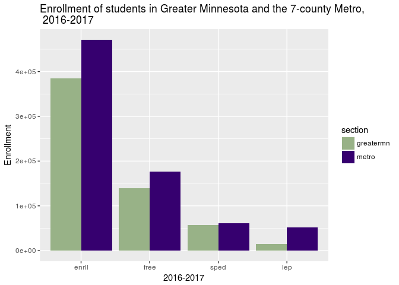

## [](#header-2)Minnesota K12: Greater Minnesota and the Metro
* Compiled and analyzed by Carla Bates.
* Page created January 2018; this page updated 2018-01-28

Increases in student poverty over the last decade have varied across the state. Every region of the state experienced an increase in k12 student poverty after the 2008 Great Recession, but some were better positioned to weather the storm and some have recovered while others are falling further behind.

The increase in poverty is against a background of low growth and even declining enrollment in some regions of the state.  As shown previously, state k12 population has grown by 28k students since 2005 and the state k12 population receiving free or reduced lunch has grown by 68k students. 

Here I slice and dice the data across multiple different area configurations:
* Greater Minnesota and the Metro Area
* An overview of Greater Minnesota by Mn Economic Development Regions
* A review of the Metropolitan statistical Areas in Minnesota and
* A look at the Metro Area by County

Given that decisions regarding funding for k12 education reside with the state legislature, it is important to understand how different legislators may view k12 education depending on what pressures the schools districts in their areas are experiencing.  


```r
mn_byRegion <- s_byDistrict %>% group_by(datayear, region) %>% fn_sumEnr(.)
greatermn <- mn_byRegion %>% filter(region != "Twin Cities") %>% mutate(section="greatermn")
metro <- mn_byRegion %>% filter(region == "Twin Cities") %>% mutate(section="metro")

g_totals <- greatermn %>% 
  filter(datayear == "16-17") %>%
  group_by(section,datayear) %>%
  fn_sumEnr(.)
m_totals <- metro %>%
  filter(datayear == "16-17")
totals <- rbind(g_totals,m_totals) %>% select(-region, -datayear)

print(head(totals))
```

```
## # A tibble: 2 x 5
## # Groups:   section [2]
##     section  enrll   free  sped   lep
##       <chr>  <int>  <int> <int> <int>
## 1 greatermn 384499 139989 56909 15248
## 2     metro 471368 176917 61417 52106
```


<!-- -->
